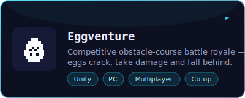
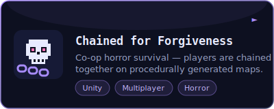

  

 

## 🕹️ About Me

- 🎮 **Senior Game Developer** at **Brok Games** (Istanbul) — building real-time multiplayer games with **Photon Fusion 2**
- 🚀 Shipped **9+ games** across **mobile, PC & WebGL** — with millions of downloads
- 🌱 Currently diving deep into **Unity Shaders** and **DOTS**
- 🧠 Interested in **programming design principles** and writing clean, scalable gameplay code
- 💬 Ask me about **Unity3D**, **multiplayer architecture** and **game development**

 

## ⚔️ Tech Arsenal

  
  
  
  
  
  
  
  

  also dabbling in backend:
  
  

 

## 🎮 Featured Projects

  
  

  
  

…and 7 more shipped titles on <a href="https://cihatyigit.netlify.app/#projects">my portfolio</a> 🎮

 

## 📊 Player Stats

  

 

## 📫 Connect

  
  
  

  

