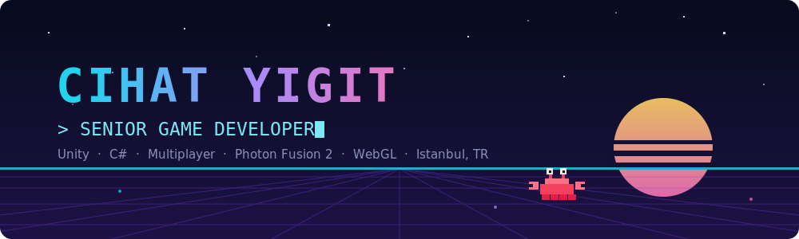
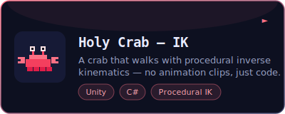
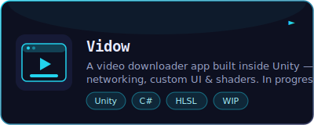
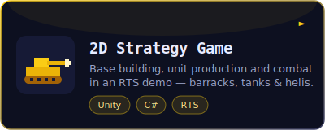
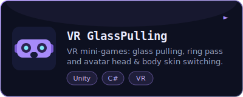

  

 

## 🕹️ About Me

- 🎮 Game developer from **Istanbul**, building games and interactive experiences with **Unity**
- 🌱 Currently diving deep into **Unity Shaders** and **DOTS**
- 🧠 Interested in **programming design principles** and writing clean, scalable gameplay code
- 💬 Ask me about **Game Development** and **Unity3D**

 

## ⚔️ Tech Arsenal

  
  
  
  
  
  

  also dabbling in backend:
  
  

 

## 🎮 Featured Projects

  
  

  
  

 

## 📊 Stats

  
  

 

## 📫 Connect

  
  
  

  

